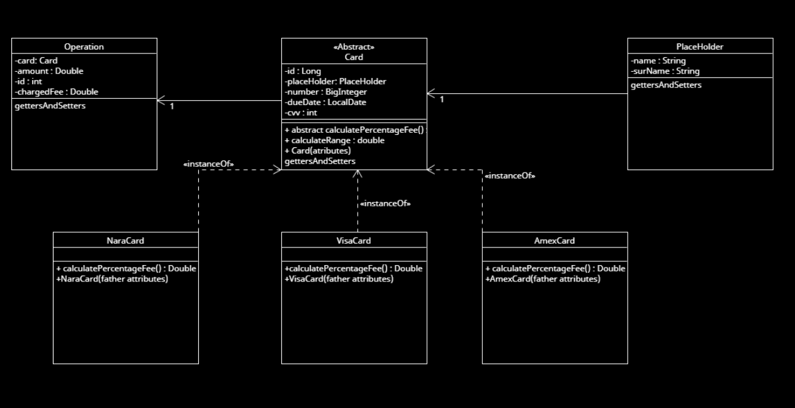
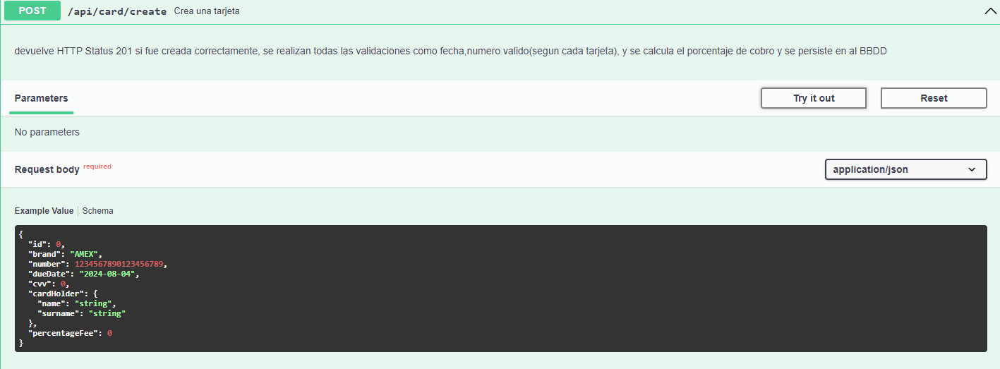

# Ejercicio 1 y 2 

## Breve descripción:

Se ha solicitado el diseño de un sistema para procesar operaciones con tarjetas de
crédito para una organización. Dicho sistema debe disponer de un módulo que lo
permita con las siguientes consideraciones,:

• Invocar un método que devuelva toda la información de una tarjeta.

• Informar si una operación es valida.

• Informar si una tarjeta es válida para operar.

• Identificar si una tarjeta es distinta a otra.

• Obtener por medio de un método la tasa de una operación informando marca e
importe.

**En este caso se decidio optar por hacer ambos ejercicios en 1 ya que coinciden en cuanto a requisitos.
De esta manera se integraron estas validaciones previamente mencionadas en los respectivos endpoints.**

---

## Las herramientas a utilizar serán:

- IntelliJ IDEA Ultimate
- JDK versión 17
- Spring Boot
- JPA/Hibernate
- Mockito
- JUnit 5
- Postman
- Lombok
- Swagger
- PostgreSql
- Git (Github)
- Jackson
- Docker / Docker Compose
- TestContainer
---
---
## Proceso de desarrollo
El planteo del diseño fue el siguiente :

En este caso como se puede ver en el diagrama , de decidio centralizar los tipos de tarjeta en una clase abstracta 
y utilizar una base de datos unica para registrar todos los tipos de tarjeta existentes bindeando con Jackson la propiedad Type para asi poder crear diversas instancias y poder ampliar el codigo con mayor facilidad.
De esta manera se puede desacoplar el tipo de instancia, de cada una y tambien utilizando el patron Strategy(mediante polimorfismo) delegar a cada clase su estrategia de calculo de Fees, ademas de esto 
se opto por utilizar un patron Factory injectable para delegar la creacion de nuevas instancias en caso de que sea requerido.

Se utilizo Lombock para agilizar el proceso de desarrollo y no tener tanto codigo boiler-plate 

Para levantar el proyecto es necesario tener Docker instalado.

### Aclaraciones importantes
Me he tomado ciertas atribuciones , como por ejemplo delimitar el porcentaje a 0.3 y 5% de fee por que en algunos casos al hacer el calculo da montos inferiores/superiores a este.
Pero en un entorno laboral estas cosas deberian ser consultadas previamente. Mismo con la base de datos de Tarjeta en si no es necesaria pero considere util registrar la tarjeta de cada operacion.
Ademas existe un metodo el cual compara una tarjeta con otra y este fue el principal proposito de esta tabla.

## Arquitectura
Se decidio optar por una estructura Controller → Service → Repository → Docker Container → Database
Priorizando una arquitectura limpia y separando las responsabilidades de cada capa manteniendo la abstraccion y reduciendo el acoplamiento.

Se utiliza Docker Compose configurado con Springboot para levantar una instancia de la base de datos auto contenida que inicia junto con el proyecto de Spring, de esta manera se puede simular el uso de una base real sin necesidad de tener un gestor de BBDD instalado.
### Dto's
Objetos de transferencia de datos, su uso fue mayormente para evitar exponer datos sensibles al front en caso de no ser necesarios.

### Manejador global de excepciones
Proporciona un codigo mas limpio ya que separa de la capa de logica de negocio todo el manejo de excepciones, en el se tratan las excepciones y se muestra un mensaje personalizado.

### ORM - JPA/HIBERNATE
Al usar un ORM se permite cambiar de base de datos segun las necesidades del negocio cambiando unas simples configuraciones.
Por ende es una herramienta muy practica para facilitar el cambio de Base de datos, ademas de la posibilida de mapear las clases en tablas
y los atributos en campos gracias al tag _"@Entity"_

### Unit Testing y Mocks (Junit - Mockito) - Integration test / Test Containers
Se decidio realizar algunos test para comprobar el correcto funcionamiento de ciertos casos de uso utilizando test unitarios con Junit para realizar estos test
y Mockito para inyectar simulaciones de estos y poder probar de forma aislada.

En cuanto a Test de integracion se decidio usar Test Containers, una herramienta muy practica que permite levantar una BBDD en un contenedor docker para realizar pruebas
en una base de datos que replicaria en este caso el ambiente productivo/desarrollo/QA. Con el proposito de hacer las pruebas lo mas real posible y eliminando la posibilidad de sobreescribir la base de datos productiva.
### Descarga del repositorio:

Para esto debemos tener instaladas las herramientas necesarias, pasamos al forkeo del repositorio.Le damos clic derecho a la carpeta donde queramos descargar el proyecto y seleccionamos la opción **GIT BASH
HERE**.Esto lo que hace es abrir la terminal de Git posicionada en la carpeta antes seleccionada. Ejecutamos el
comando *git clone* “url del repositorio”, cambiando lo que está entre comillas por el comando obtenido.

### Intellij Idea:

Una vez instalado IntelliJ IDEA Ultimate, debemos ingresar una licencia de estudiante o una licencia de paga. También
podemos optar por la versión gratuita Community.

Una vez instalado, abrimos el proyecto desde IntelliJ y debemos esperar a que se instalen las dependencias de Maven,
mientras esto sucede, si no tenemos un JDK instalado, en la parte superior del IDE nos aparecerá una barra azul con un
mensaje: “Setup SDK”. Desde aquí ingresamos la versión 17, para la correcta ejecución del proyecto. Una vez instalado
todo, nos movemos al archivo y damos en “Run”.

## Base de Datos:

Para la correcta ejecucion de la base de datos es necesario tener Docker previamente instalado , de esta manera la BBDD se levanta en un contenedor de docker de forma automatica al correr el proyecto.
Simulando un entorno lo mas real posible y esta base se reinicia luego de finalizar la ejecucion.

## Cómo usar postman

Postman nos ayuda a ser más eficientes durante todo el ciclo de vida de desarrollo de una API. Nos permite crear
rápidamente solicitudes con el método HTTP necesario y parámetros en caso de necesitarlo, enviar la solicitud e
inspeccionar fácilmente los resultados.

### Instalando POSTMAN:

Para instalar postman lo podemos descargar desde su página web, postman
https://www.getpostman.com/
Una vez instalado, tenemos la lista de métodos HTTP, regularmente las más utilizadas serán GET, POST, PUT, DELETE.

## Cómo usar Swagger
Para el testeo de endpoints recomiendo usar swagger ya que brinda la facilidad de tener todo precargado y listo para usar.
Al igual que postman, Swagger nos ayuda a ser más eficientes durante todo el ciclo de vida de desarrollo de una API.
Ademas, nos permite generar documentacion automatica con solo unas pocas configuraciones y sin necesidad de descargar nada extra.
La facilidad es que permite documentar endpoints y ademas pueden visualizarse sus estructuras de request/response con ejemplos.
Para acceder a swagger es necesario ingresar una vez levantado el proyecto a : http://localhost:8080/swagger-ui/index.html .
donde podras visualizar todos los endpoints y para poder realizar un request es necesario que clickees en el boton _"try it out"_ 

---

### Posibles mejoras
Al utilizar bigInteger me di cuenta que javascript tiene una limitacion y redondea los numeros , asi que una opcion podria ser modificarlo por strings o bypassear este parseo que se realiza.

Utilizar tanto para el request como Response los Dtos para esconder los datos inecesarios (Se cumple, pero parcialmente).

Agregar validación al CVV para que solamente tolere números de 3 digitos

Realizar todos los test para tener un coverage +80%

El enum de brand genera un error si se manda otro tipo que no sean los soportados, este es un inconveniente en el cual incurri al querer manejar 
Las 3 instancias de una clase en una sola base de datos, por eso era necesario pasar en la clase Card el campo Brand como enum para diferenciar que instancia se crea
,obviamente esto puede estar sujeto a mejoras.